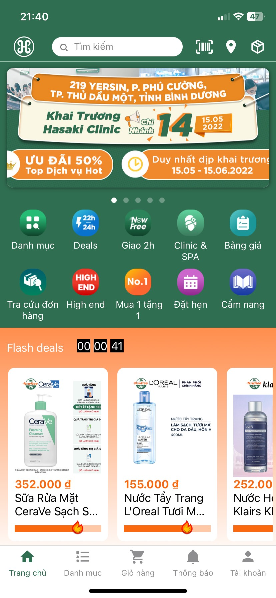
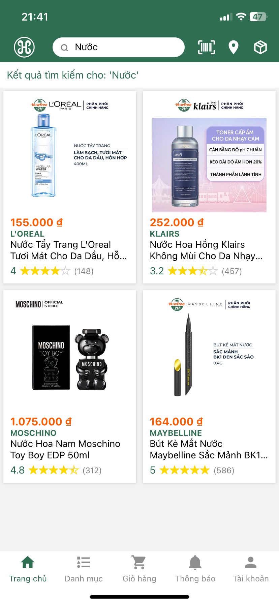
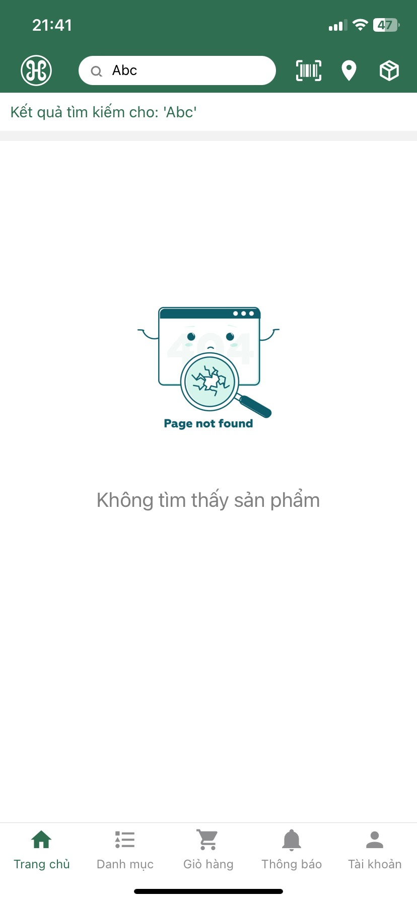
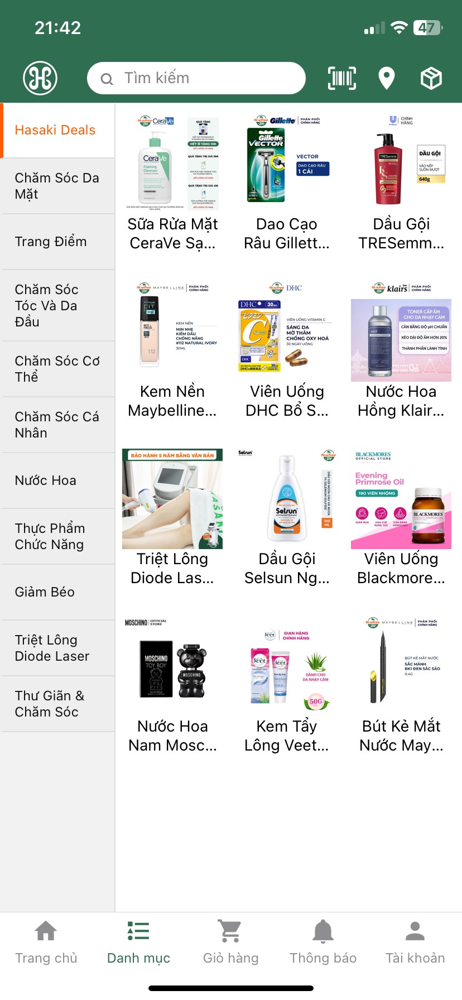
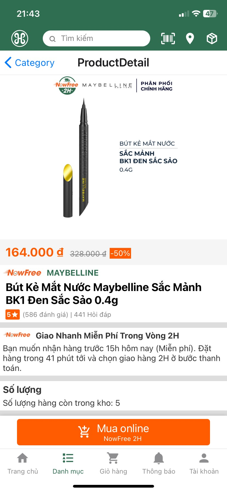
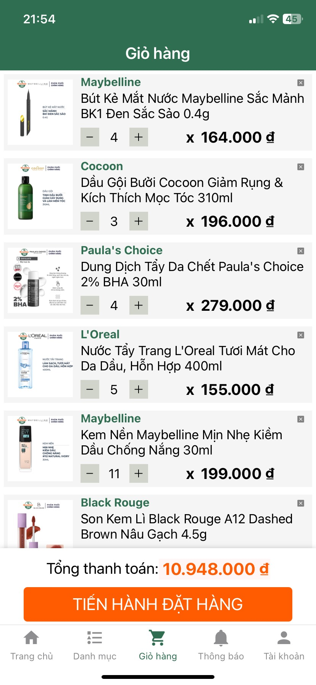
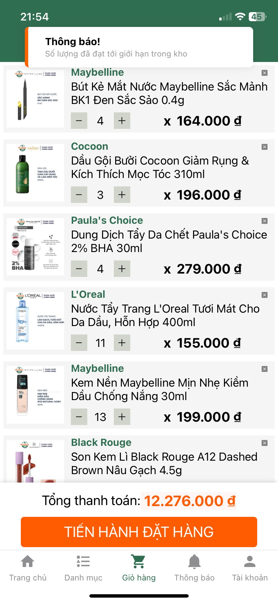
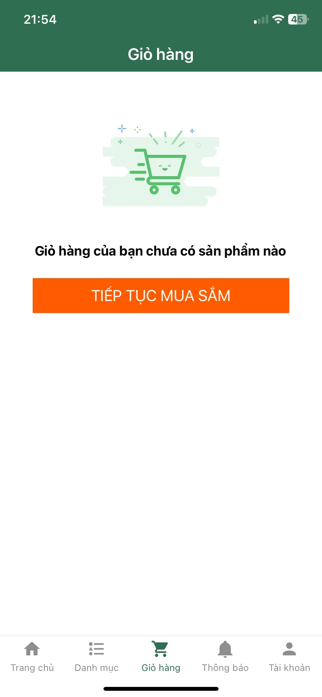

# HasakiApp_ReactNative

Dự án ứng dụng bán hàng online Hasaki chuyên kinh doanh các mặt hàng mỹ phẩm.


## Công nghệ và công cụ sử dụng

            


## Các bước triển khai ứng dụng

Ứng dụng này được thiết kế để có thể hoạt động tốt ở cả môi trường web và App Expo Go trên điện thoại. Vui lòng thực hiện đủ các bước sau để có thể đảm bảo ứng dụng hoạt động đúng.

Bước 1: Mở cmd và chạy lệnh ipconfig, sau đó ở phần Wireless LAN adapter Wi-Fi -> ta lấy IPv4 Address của thiết bị có dạng '192.168.x.x'.

Bước 2: Mở project lên và vào thư mục fetchData, trong đó có 2 file fetchProducts và fetchCategory. Sửa địa chỉ ip trong đường dẫn ở cả 2 file có dạng 'http://192.168.x.x:3000/products' thành địa chỉ ip của mình đã lấy ở bước 1.

Bước 3: Khởi động json-server bằng cách chạy lệnh sau trong Terminal.
```bash
  npm run start-json-server
```
Bước 4: Khởi động ứng dụng trên môi trường web bằng cách chạy lệnh sau trong một Terminal khác.
```bash
  npm run web
```
Tới đây thì ứng dụng đã có thể khởi chạy trên web, để triển khai trên điện thoại vui lòng thực hiện các bước tiếp theo.

Bước 5: Tải ứng dụng Expo Go trên điện thoại từ App Store hoặc Google Play.

Bước 6: Đảm bảo máy tính đang chạy ứng dụng và điện thoại sử dụng đang cùng kết nối vào một mạng WiFi. Sau đó quét mã QR Code hiện trên Terminal sau khi chạy npm run web ở bước 4.

Như vậy là đã thực hiện thành công các bước triển khai ứng dụng trên web và trên cả di động. Chúc bạn thành công.


## Demo các chức năng của ứng dụng
(Các screenshot demo được chụp từ iPhone)
- Sử dụng BottomTab để thể hiện thanh điều hướng phía dưới màn hình.
- Banner tự động chuyển ảnh mỗi 3s ở đầu trang Homepage.
- Flash Deals với đồng hồ đếm ngược và thanh trượt cực cháy.

- Chức năng tìm kiếm sản phẩm và hiển thị danh sách sản phẩm có tên gần giống với từ khóa tìm kiếm.

- Nếu không tìm thấy sản phẩm nào sẽ hiện hình ảnh thông báo rằng không tìm thấy.

- Danh mục sản phẩm với 2 FlatList render các sản phẩm bên phải tùy theo danh mục được chọn bên trái. Danh mục 'Hasaki Deals' sẽ render 12 sản phẩm ngẫu nhiên. Các sản phẩm được fetch data từ json-server.

- Chọn vào mỗi sản phẩm sẽ dẫn đến trang chi tiết sản phẩm, có thể thêm sản phẩm vào giỏ hàng bằng cách nhấn nút 'Mua online'.

- Giỏ hàng có các chức năng tăng, giảm số lượng và xóa sản phẩm khỏi giỏ hàng. Sử dụng Redux để quản lí trạng thái giỏ hàng.

- Nếu thêm quá số lượng hàng trong kho thì sẽ hiện thông báo đã quá số lượng.

- Nếu không có sản phẩm nào trong giỏ hàng thì sẽ hiện thông báo và nút 'Tiếp tục mua sắm' dẫn đến trang chủ Homepage.

- Trang thông báo lấy dữ liệu các thông báo từ link mockAPI.io và render thành FlatList.


